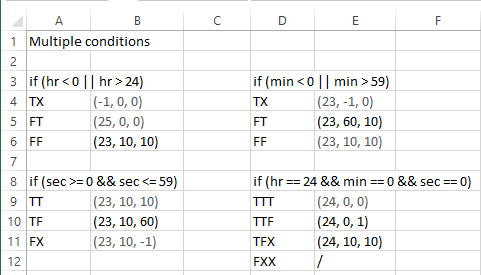

3. Цикломатската комплексност е 8. Ја добив преку бројот на предикатни јазли, кој е 7, плус 1.
Може да се добие и преку формулата:
E – N + 2 = 30 – 24 + 2 = 8
каде што E е број на ребра, а N е број на јазли.

4. Бидејќи повеќето од проверките се опфатени во every branch тестовите, овде се направени само некои дополнителни тестови кои што ги нема во every branch тестовите. Тие тестови кои веќе се опфатени во претходните тестови се прикажани на сликата подоле со побледа боја. Со multiple condition се тестираат сите можни комбинации на изразите во предикатните јазли. Со користење на Lazy Evaluation елиминирани се некои од комбинациите. Кај условот if (h == 24 && min == 0 && sec == 0) последната комбинација никогаш нема да се изврши, бидејќи ќе влезе во некој од претходните услови и затоа е целосно отстранета.
 
 
5. Со every branch тестовите се покриваат сите можни гранки од control flow графот. За да се покријат сите гранки потребни беа вкупно 6 тест случаи. 5 тест случаи за 5-те различни типови на exceptions и 1 тест случај за нормалното завршување на програмата. Every branch тест случаите се прикажани на сликата подоле.
 
 
7. За случаите каде што не се случува exception користев assertEquals() што проверува дали излезот од функцијата се совпаѓа со точниот резултат. За случаите каде што се случува exception користев assertThrows() што проверува дали функцијата го фрла соодветниот exception со соодветната порака.
